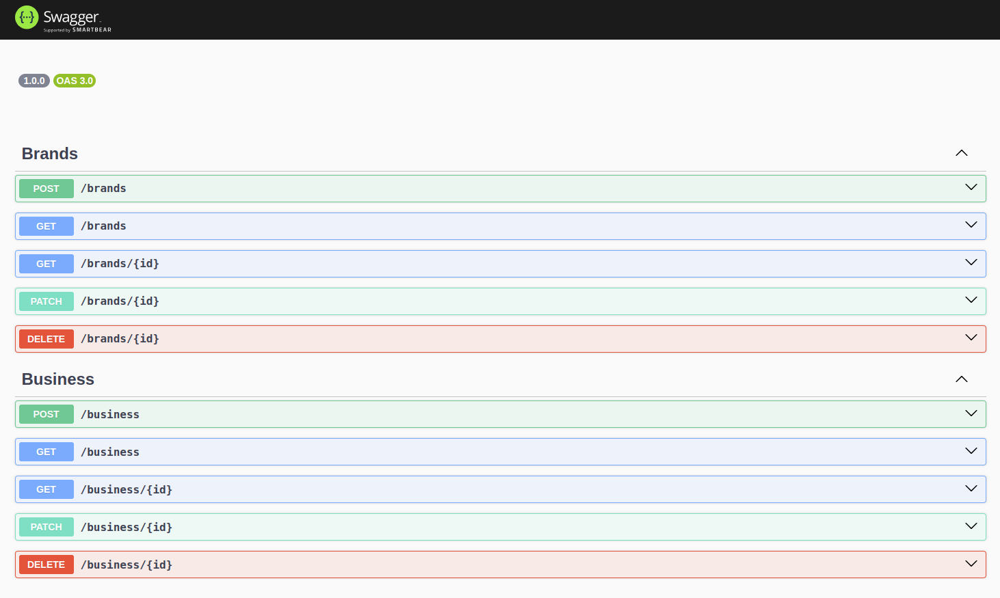
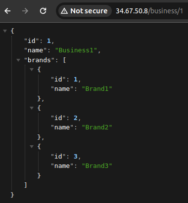
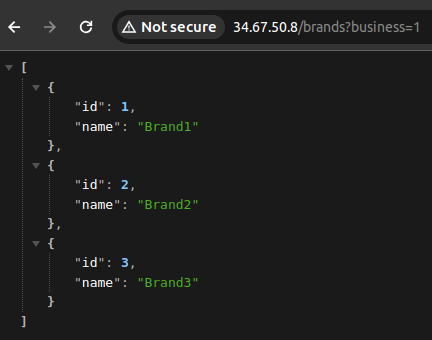
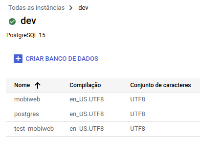
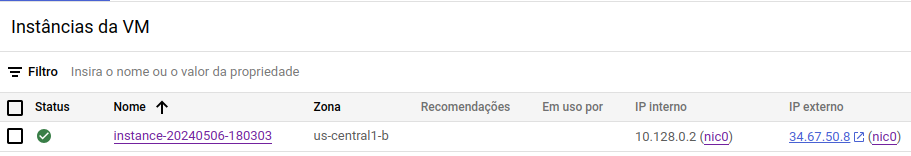

<p align="center">
  <a target="blank"></a>
</p>

## Description

This repository contains a dockerized NestJS API, developed as a solution to a technical challenge proposed by [Mobiweb](https://mobiweb.pt/) in May 2024 and publicly available via the url http://34.67.50.8. The API has CRUDs for two distinct entities (Business and Brand) and its development followed the standard architecture provided by [NestJS](https://nestjs.com/), using *TypeScript* to create *Controllers*, *Services*, *Repositories*, *DTOs*, etc.

## Pre-requisites
- Git
- Docker

## Running the app

Step by step to run the project locally:

1. Clone the repository in a directory of your choice
2. Access the folder in which the repository was cloned
3. Create an ```.env``` file in the root of the repository containing the following variables: 

```
DATABASE_HOST=34.138.223.172
DATABASE_NAME=mobiweb
DATABASE_PORT=5432
DATABASE_USER=postgres
DATABASE_PASSWORD=<PASSWORD> (sent by email)
```
4. Run the command to build the container: ```docker compose build```
5. Run the command to run the container: ```docker compose up```

If everything went well, the API will be available at http://localhost.

## Endpoints documentation

This project uses the [@nestjs/swagger](https://www.npmjs.com/package/@nestjs/swagger) module to automatically generate documentation based on the [OpenAPI](https://www.openapis.org/) specification. The generated page allows you to view existing endpoints, payload and response formats, etc. You can also use the documentation to test the endpoints with real data.

<p align="center">
  <a target="blank"></a>
</p>

The documentation can be accessed locally or remotely via the ```/docs``` endpoint.
- Locally: http://localhost/docs
- Google Cloud: http://34.67.50.8/docs

## Endpoint to get a business' brands

One of the requirements of the challenge was to implement an endpoint that receives the ID of a business and returns the brands associated with it, so I will use the API available in the cloud to demonstrate two ways of obtaining the desired result:

1. By default, GET /business returns the brands associated with each business, so we can use this GET with the ID of a specific business to view its brands (http://34.67.50.8/business/1).
<p align="center">
  <a target="blank"></a>
</p>

2. A ```business``` filter has been implemented in GET /brands to filter only the brands that belong to a particular business, so it's quite simple to list the brands of a particular business (http://34.67.50.8/brands?business=1).
<p align="center">
  <a target="blank"></a>
</p>

## Migrations

The integration with the SQL database and project migrations are managed by the [TypeORM](https://typeorm.io/) module.

```bash
# Generate migration based on code entities
npm run migration:generate --name=<migration_name>

# Generate empty migration
npm run migration:create --name=<migration_name>

# Run migrations
npm run migration:run

# Revert last migration applied
npm run migration:revert
```

## Tests

E2E tests have been implemented for all of the application's endpoints to ensure that the implementation is robust. The tests should be run via the container's bash.

```bash
# Acess container bash
docker exec -it <CONTAINER_ID> bash

# Run e2e tests
npm run test:e2e
```

## Deploy

The API was deployed through two Google Cloud Platform (GCP) services:

- Google Cloud SQL: creation of two PostgreSQL databases, one for the application (mobiweb) and the other for running e2e tests (test_mobiweb).
<p align="center">
  <a target="blank"></a>
</p>

- Google Cloud Compute Engine: creation of a Virtual Machine (VM) with the *Container-Optimized OS* operating system, suitable for deploying containers.
<p align="center">
  <a target="blank"></a>
</p>
